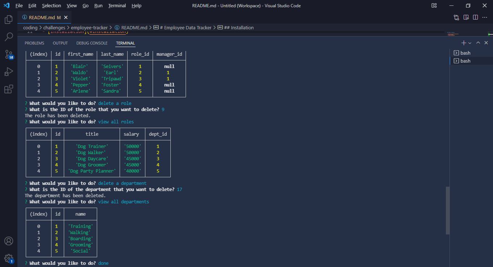

# Employee Data Tracker

## Description
My motivation in creating this file generator is to expand my knowledge with using SQL.
I built this project to assist in making and editing a database of employee data.
This will make it easy to see and edit who is on your team and all of their info in one place.
I learned how to use MySql to help further my coding abilities.

## Table of Contents 

- [Installation](#installation)
- [Usage](#usage)
- [Credits](#credits)

## Installation

Install MySql and Node on your computer. Run 'npm i' in the appropriate directory in your terminal. Make sure you are in the correct file directory and type 'node index' in the terminal to begin a series of questions to help populate your employee database. When done, select done, or press 'ctrl c' on the keyboard to exit the program.

## Usage
[Walkthrough Video](https://drive.google.com/file/d/1KiaAUmvzfYGX5_FtQywDb3ZkhyQriUhj/view)

## Credits

created by Blair Seivers